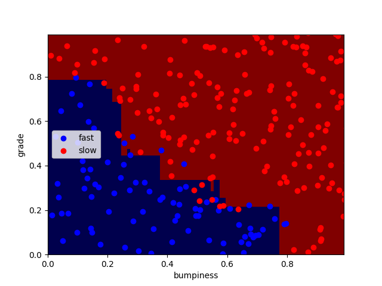
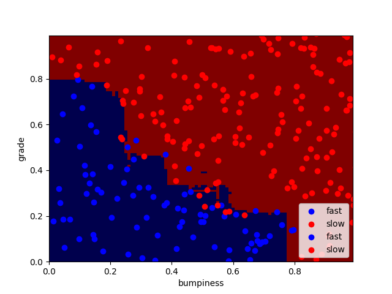
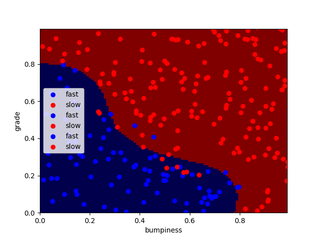
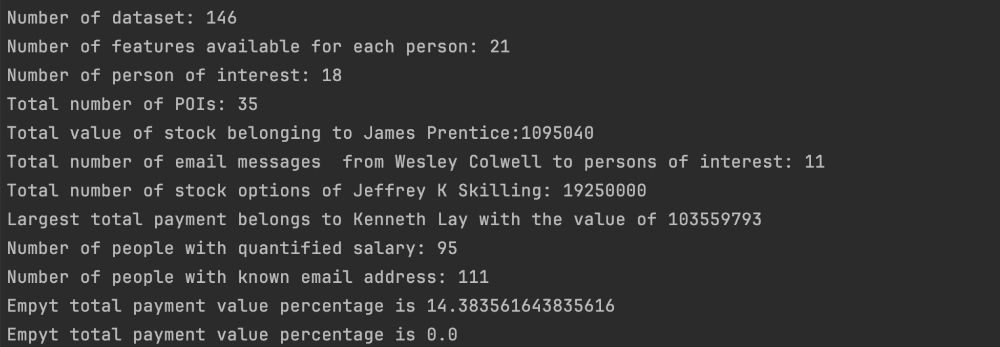
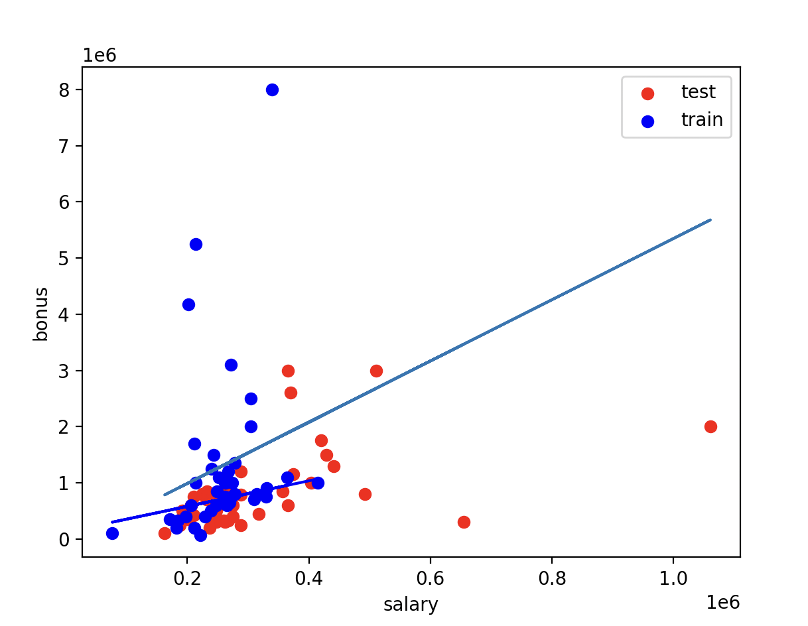
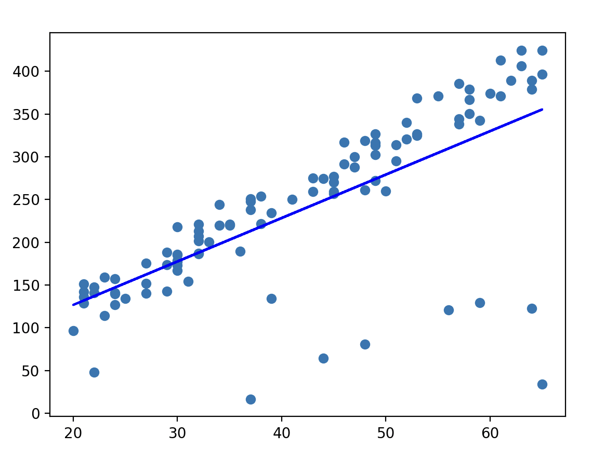
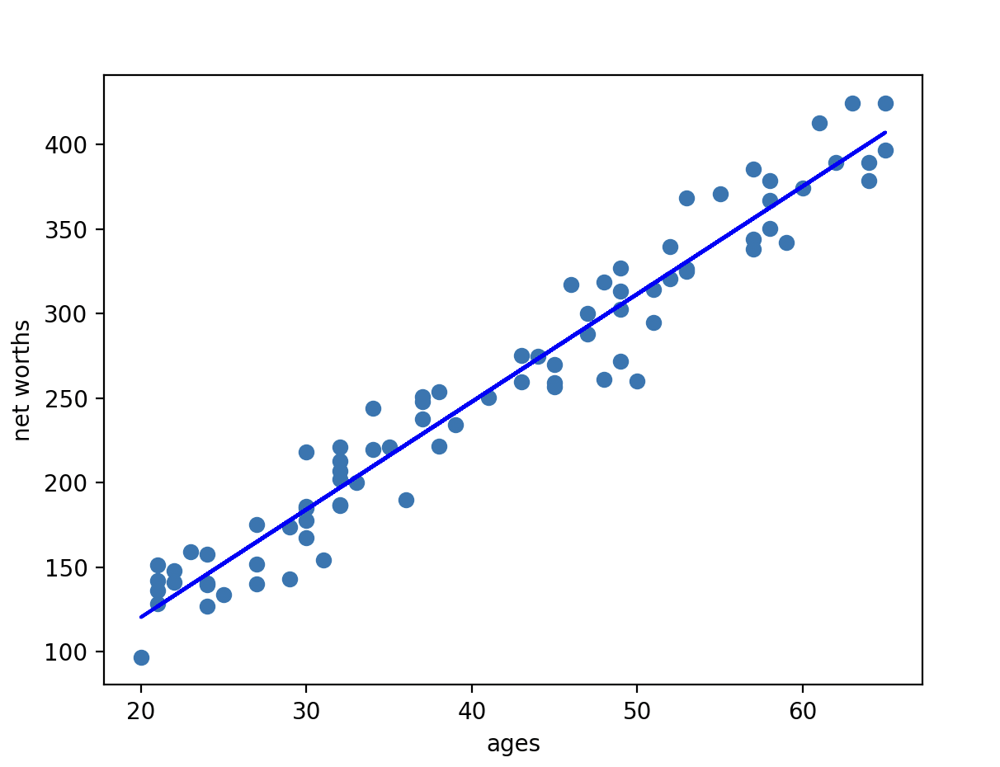
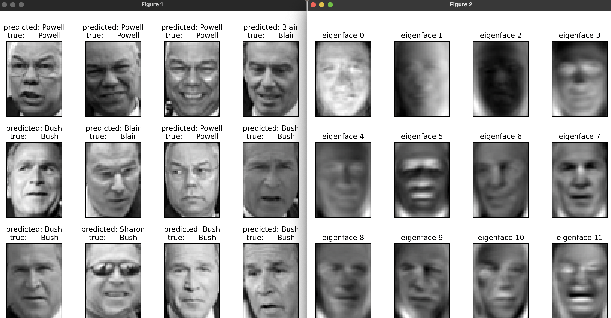
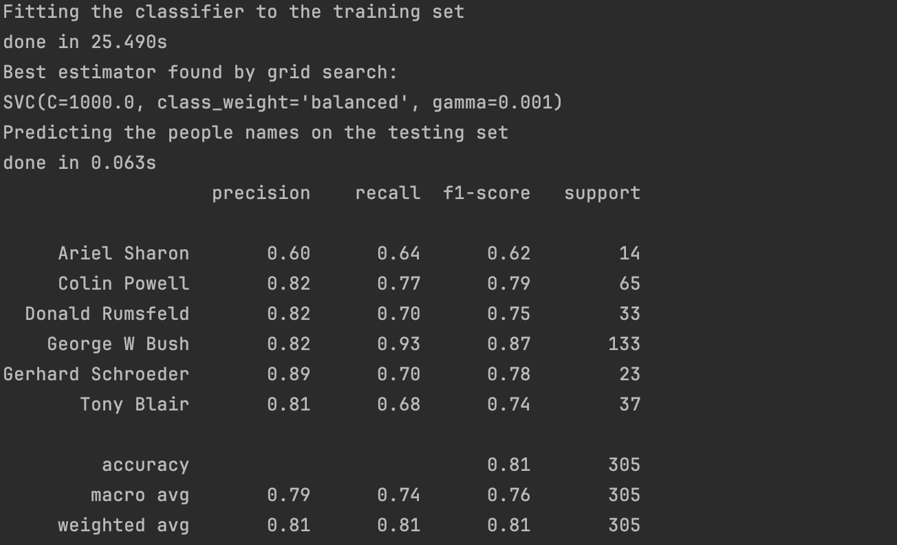
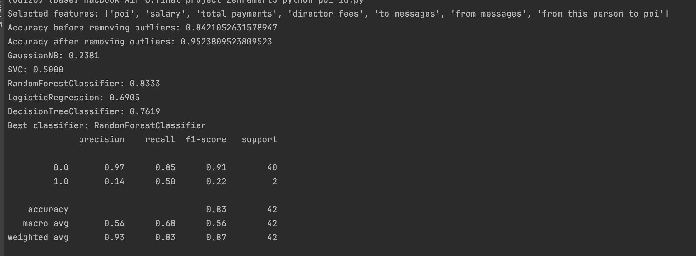

# Intro to Machine Learning - Course Projects

This repository contains solutions for the projects in Udacity's Intro to Machine Learning course. The course covers a wide range of machine learning topics, and each project focuses on applying techniques and algorithms to solve specific problems. Below is a summary of each project.

# Project Titles

### Naive Bayes
- Description: Implements and evaluates Naive Bayes classifiers using a given dataset.
- Key Concepts: Probabilistic classifiers, Bayes' theorem, feature independence.

### SVM
- Description: Applies SVM algorithms to classify data and tune hyperparameters for better performance.
- Key Concepts: Margin maximization, kernel tricks, hyperparameter tuning.

### Decision Trees
- Description: Builds and assesses decision tree models for classification tasks.
- Key Concepts: Tree construction, splitting criteria, pruning.

### Choose Your Own Algorithm
- Description: The goal of this mini-project is to implement terrain classification using one of the following machine learning algorithms and evaluate its performance:
* AdaBoost
* RandomForest
* SVM
I implemented each classification algorithm and compared their accuracy and visualized the decision boundaries for all classifiers using the prettyPicture function
- Key Concepts: Boosting, ensemble learning, weighted classification.
  
  * AdaBoost Algorithm
    
  

  * RandomForest Algorithm
    
  

  * SVM
    
  

### Dataset&Questions
- Description: Focuses on exploring and preparing datasets for machine learning tasks.
- Key Concepts: Data cleaning, feature engineering, dataset splitting.
- Output:

### Regression
- Description: Applies regression techniques to determine relationship between a target and features.
- Key Concepts: Linear regression, polynomial regression, evaluation metrics.
- Output:

  

### Outlier Detection
- Description: Implements methods to detect and handle outliers in data.
- Key Concepts: Statistical methods, distance-based methods, outlier removal.
- Output:

  
  
  

### Clustering
- Description: Applies clustering algorithms to group similar data points.
- Key Concepts: K-means clustering, hierarchical clustering, evaluation metrics.

### Feature Scaling
- Description: Demonstrates techniques for normalizing and standardizing features in datasets.
- Key Concepts: Standardization, normalization, impact on model performance.

### Feature Selection
- Description: Selects the most relevant features for building models.
- Key Concept: SelectKBest, SelectPercentile

### Text Learning
- Description: Uses machine learning techniques to analyze and classify text data.
- Key Concepts: nltk, Tldf

### PCA
- Description: Implements PCA for dimensionality reduction and visualization.
In this mini project, I used PCA for feature extraction and dimensionality reduction, followed by training an SVM classifier for face recognition.
- Key Concepts: Eigenvectors, eigenvalues, variance explanation.
- Output:

### Validation
- Description: Focuses on techniques for validating model performance.
- Key Concepts: Cross-validation, training/testing split, overfitting.

### Evaluation Metrics
- Description: Evaluates model performance using various metrics.
- Key Concepts: Accuracy, precision, recall, F1 score, ROC curve.

# Final Project: Enron Email Dataset Analysis
## Description

The final project of the Udacity Intro to Machine Learning course involves analyzing the Enron email dataset to identify POIs in a corporate fraud investigation. The project integrates various machine learning techniques learned throughout the course, such as classification, feature selection, and evaluation metrics, to build a robust model.

## Project Workflow

- Dataset Overview:
  * Source: The dataset contains financial and email data of Enron employees.
  * Structure: Each record in the dataset represents an employee with features such as salary, bonus, and email communication metrics. The target variable indicates whether the employee is a POI (Person of Interest).

- Data Exploration:
  * Loading the Dataset: The dataset is loaded using Python's pickle module.
  * Initial Exploration: Basic statistics are computed to understand the distribution of data, missing values, and anomalies.

- Feature Engineering:
  * Feature Selection: Relevant features are selected based on domain knowledge and statistical analysis. Features that are highly correlated with the target variable (POI) are prioritized.
  * New Feature Creation: New features can be created from existing ones, such as the ratio of emails sent to POIs to the total number of emails sent.

- Outlier Detection and Handling:
  * Identifying Outliers: Outliers are identified using error calculation.
  * Removing Outliers: Records that significantly deviate from the norm and are likely to skew the model's performance are removed.

- Algorithm Selection:
  * Choosing Algorithms: Several classification algorithms are evaluated, such as Decision Trees, Naive Bayes, and Support Vector Machines (SVM).

- Model Training and Evaluation:
  * Training: The selected algorithms are trained on the dataset using a train-test split or cross-validation.
  * Evaluation Metrics: Models are evaluated using metrics like precision, recall, F1-score, and accuracy. The confusion matrix is also analyzed to understand the performance in identifying POIs.

- Validation and Testing:
  * Cross-Validation: Cross-validation is used to ensure the model's robustness and generalizability.

- Results and Conclusion:
  * Model Performance: The performance of the final model is reported, highlighting key metrics and the overall effectiveness in identifying POIs.

